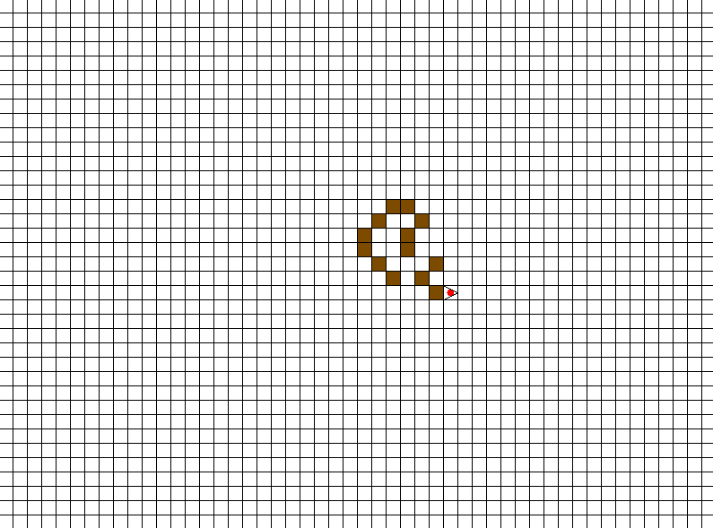
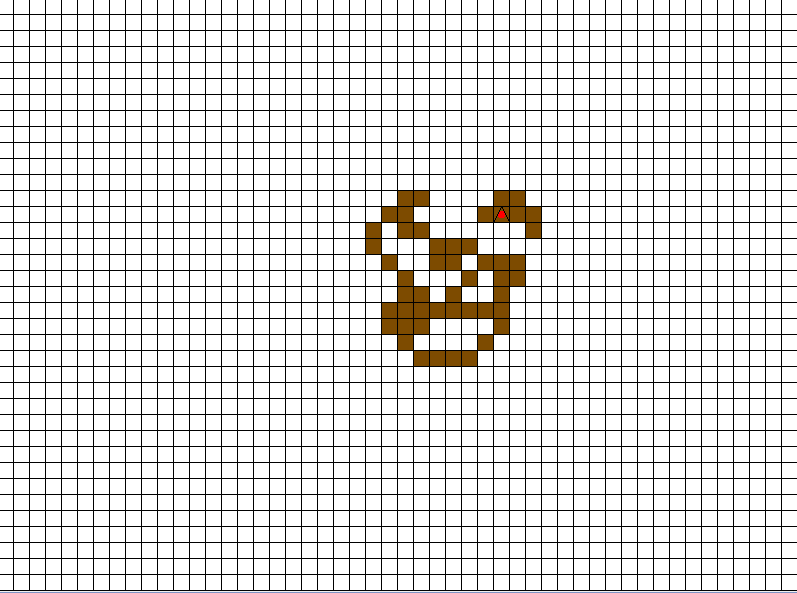

This is a Langton's ant simulator I wrote in 2015. I thought I lost the source a long time ago with operating system reinstalls and what not, but I guess I did still have it.  
The implementation could definitely be better, but it comes with a nice session dump feature :)

  
  
  
  

#### license

MIT
